# Bank Onboarding Workflow & Testing Guide

Follow these steps to complete the Bank Onboarding process in the Loan Marketplace, including authentication, registration, KYC document uploads, and team member invitations.

---

## Step 1: User Registration

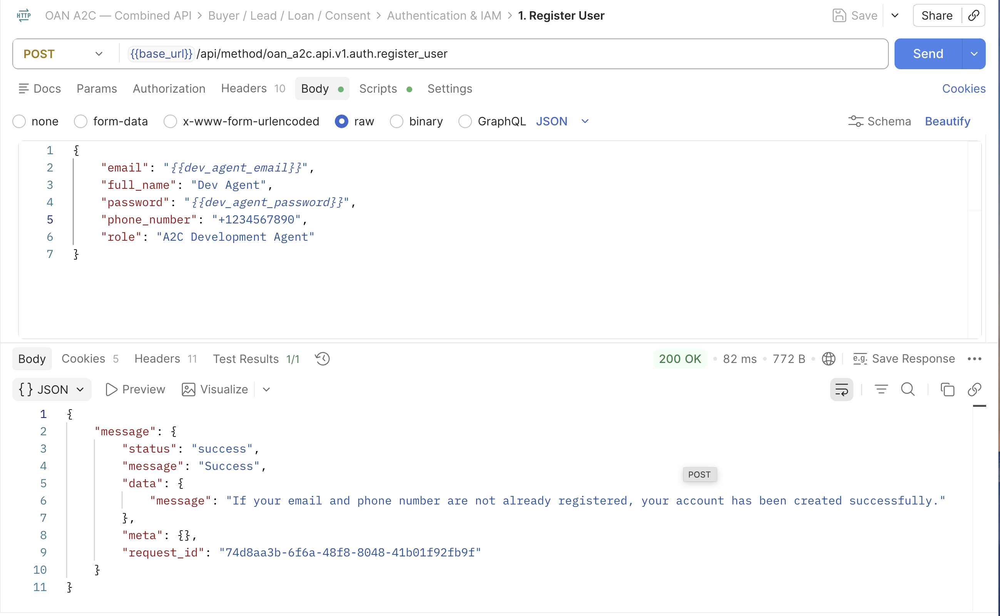

**POST** `/api/method/oan_a2c.api.v1.auth.register_user`

Registers a new user account with a default role of `A2C Bank Admin`.

### Expected Request Body

```json
{
  "email": "{{email}}",
  "full_name": "{{full_name}}",
  "password": "{{password}}",
  "phone_number": "{{phone_number}}"
}
```

#### Variables


| Variable           | Source                                                                                 | Example          |
| -------------------- | ---------------------------------------------------------------------------------------- | ------------------ |
| `{{email}}`        | Must be a valid email address format                                                   | `admin@bank.com` |
| `{{full_name}}`    | Min length 2 characters                                                                | `Abebe Kebede`   |
| `{{password}}`     | Min 8, max 64 chars. Must contain at least 1 letter, 1 number, and 1 special character | `password123!`   |
| `{{phone_number}}` | Must be a valid phone number format                                                    | `+251911111111`  |

### Success Response

```json
{
  "status": "success",
  "message": "If your email and phone number are not already registered, your account has been created successfully.",
  "data": {
    "message": "If your email and phone number are not already registered, your account has been created successfully."
  }
}
```

#### User Interface

The signup page where the primary Bank Administrator creates their account before starting the onboarding process.

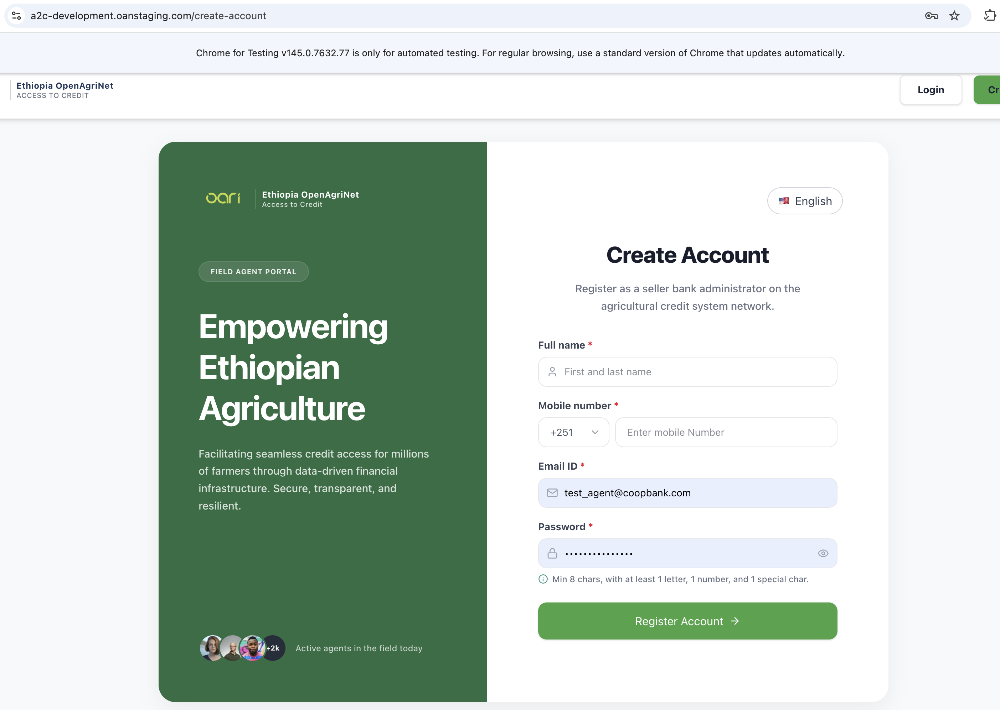

---

## Step 2: Authentication

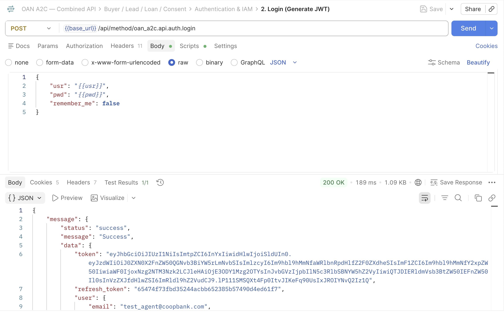
**POST** `/api/method/oan_a2c.api.auth.login`

Authenticate your credentials to obtain the required JWT Bearer token for all subsequent onboarding requests.

### Expected Request Body

```json
{
  "usr": "{{usr}}",
  "pwd": "{{pwd}}",
  "remember_me": {{remember_me}}
}
```

#### Variables


| Variable          | Source                  | Example          |
| ------------------- | ------------------------- | ------------------ |
| `{{usr}}`         | User email address      | `admin@bank.com` |
| `{{pwd}}`         | User password           | `password123`    |
| `{{remember_me}}` | Extend token expiration | `false`          |

### Success Response

```json
{
  "status": "success",
  "message": "Success",
  "data": {
    "token": "eyJhbGciOiJIUzI1NiIsIn...",
    "refresh_token": "a1b2c3d4e5f6...",
    "user": {
      "email": "admin@bank.com",
      "full_name": "Abebe Kebede",
      "roles": ["A2C Bank Admin", "System Manager"],
      "bank": null
    }
  }
}
```

#### User Interface

The onboarding user first needs to log into the portal. The system uses the returned JWT token to authorize the remaining onboarding steps.

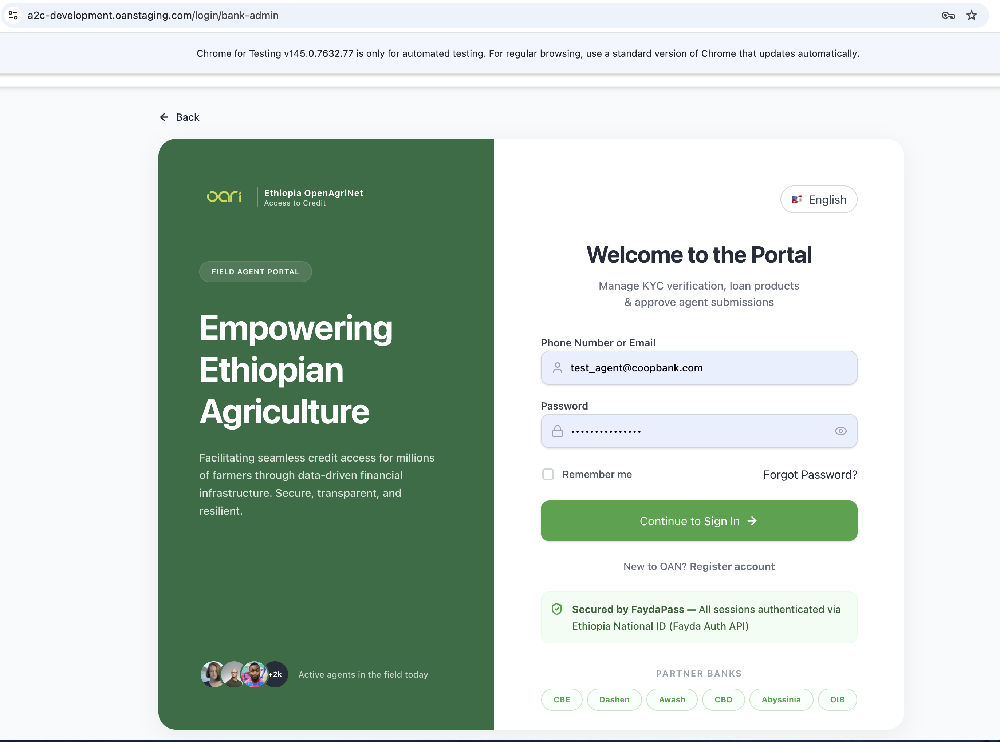

---

## Step 3: Register Bank Entity

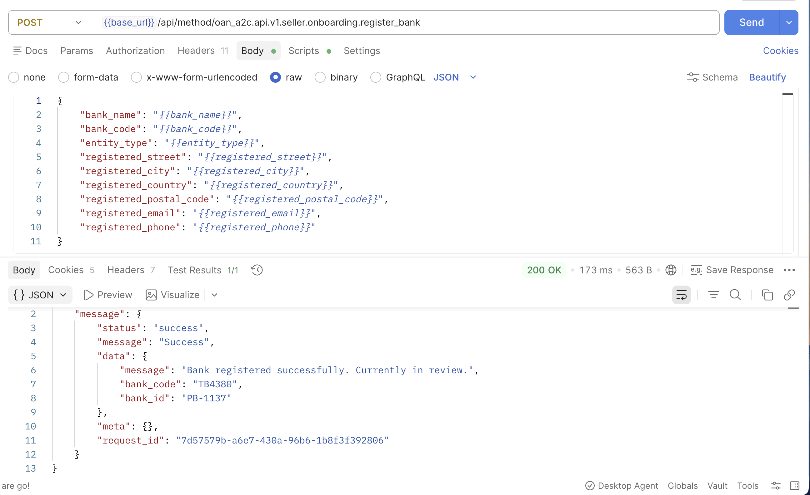

**POST** `/api/method/oan_a2c.api.v1.seller.onboarding.register_bank`

Registers a new participating bank entity. This binds your user account as the default admin for the bank.

**Note:** This endpoint requires the JWT Bearer token. You must not already be associated with an organization.

### Expected Request Body

```json
{
  "bank_name": "{{bank_name}}",
  "bank_code": "{{bank_code}}",
  "entity_type": "{{entity_type}}",
  "registered_street": "{{registered_street}}",
  "registered_city": "{{registered_city}}",
  "registered_country": "{{registered_country}}",
  "registered_postal_code": "{{registered_postal_code}}",
  "registered_email": "{{registered_email}}",
  "registered_phone": "{{registered_phone}}"
}
```

#### Variables


| Variable                     | Source                  | Example                   |
| ------------------------------ | ------------------------- | --------------------------- |
| `{{bank_name}}`              | Legal name of the bank  | `Example Bank`            |
| `{{bank_code}}`              | TIN / unique identifier | `BNK001`                  |
| `{{entity_type}}`            | Entity type             | `Bank`                    |
| `{{registered_street}}`      | Street address          | `Bole Road`               |
| `{{registered_city}}`        | City                    | `Addis Ababa`             |
| `{{registered_country}}`     | Country                 | `Ethiopia`                |
| `{{registered_postal_code}}` | Postal Code             | `1000`                    |
| `{{registered_email}}`       | Corporate email address | `contact@examplebank.com` |
| `{{registered_phone}}`       | Corporate phone number  | `+251900000000`           |

### Success Response

```json
{
  "status": "success",
  "message": "Bank registered successfully. Currently onboarding.",
  "data": {
    "message": "Bank registered successfully. Currently onboarding.",
    "bank_code": "BNK001",
    "bank_id": "A2C-BANK-0001"
  }
}
```

#### User Interface

The initial organization registration form captures core bank details such as the legal entity name, TIN, and corporate address.

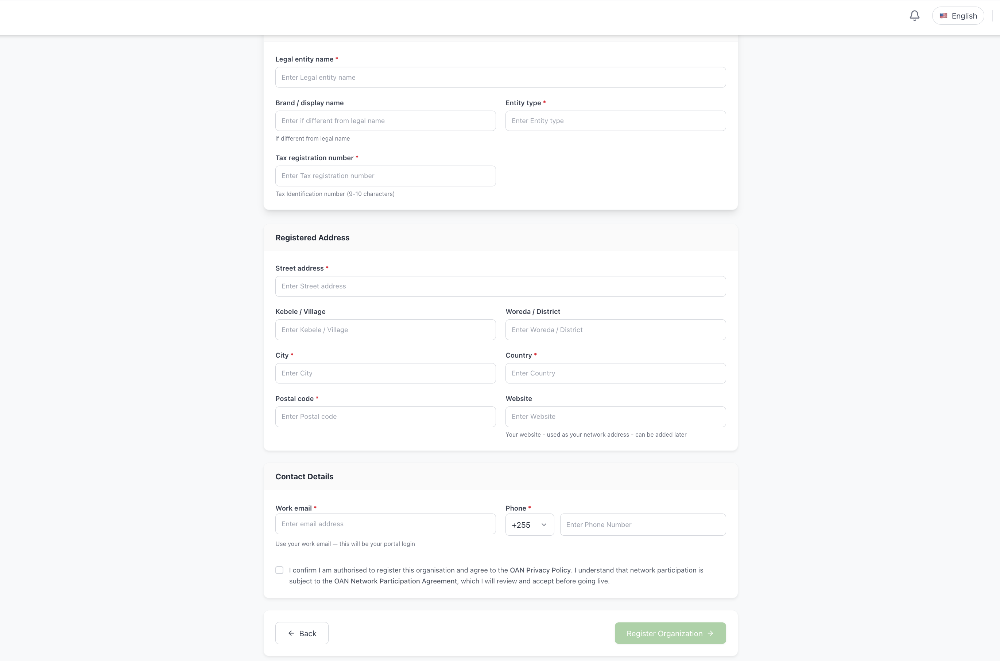

---

## Step 4: Upload KYC Document


**POST** `/api/method/oan_a2c.api.v1.seller.onboarding.upload_kyc_document`

Upload the mandatory KYC document (PDF) for the organization.

### Expected Request Body

```json
{
  "filename": "{{filename}}",
  "filedata": "{{filedata}}"
}
```

#### Variables


| Variable       | Source                    | Example            |
| ---------------- | --------------------------- | -------------------- |
| `{{filename}}` | Must end in`.pdf`         | `kyc_document.pdf` |
| `{{filedata}}` | Base64-encoded PDF string | `JVBERi0xLjQ...`   |

### Success Response

```json
{
  "status": "success",
  "message": "KYC document uploaded successfully.",
  "data": {
    "message": "KYC document uploaded successfully.",
    "file_url": "/private/files/kyc.pdf"
  }
}
```

#### User Interface

The document upload screen allowing the administrator to attach a required PDF for KYC compliance.

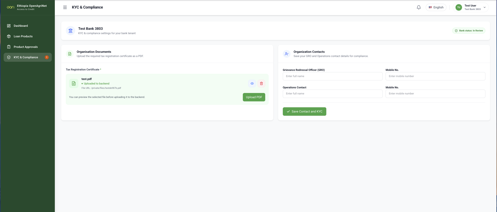

---

## Step 5: Save Organization Contacts

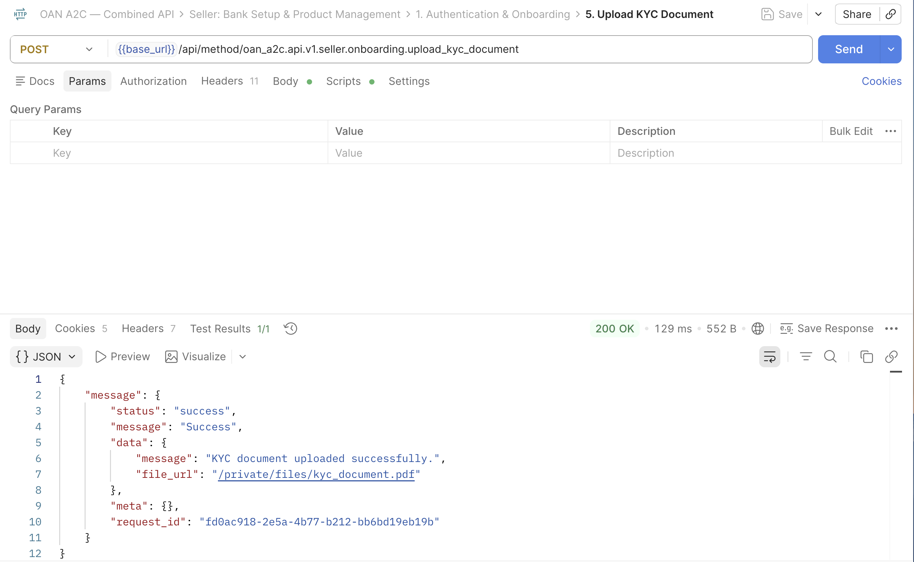

**POST** `/api/method/oan_a2c.api.v1.seller.onboarding.save_org_contacts`

Save the Grievance Redressal Officer (GRO) and Operations (OPS) contact details for the bank.

### Expected Request Body

```json
{
  "gro_name": "{{gro_name}}",
  "gro_mobile": "{{gro_mobile}}",
  "ops_name": "{{ops_name}}",
  "ops_mobile": "{{ops_mobile}}"
}
```

#### Variables


| Variable         | Source                    | Example         |
| ------------------ | --------------------------- | ----------------- |
| `{{gro_name}}`   | GRO Name                  | `Abebe GRO`     |
| `{{gro_mobile}}` | GRO Mobile                | `+251911111111` |
| `{{ops_name}}`   | Operations Contact Name   | `Kebede OPS`    |
| `{{ops_mobile}}` | Operations Contact Mobile | `+251922222222` |

### Success Response

```json
{
  "status": "success",
  "message": "Contacts saved successfully.",
  "data": {
    "message": "Contacts saved successfully."
  }
}
```

#### User Interface

The contact details section of the onboarding wizard where GRO and Operational contacts are specified.

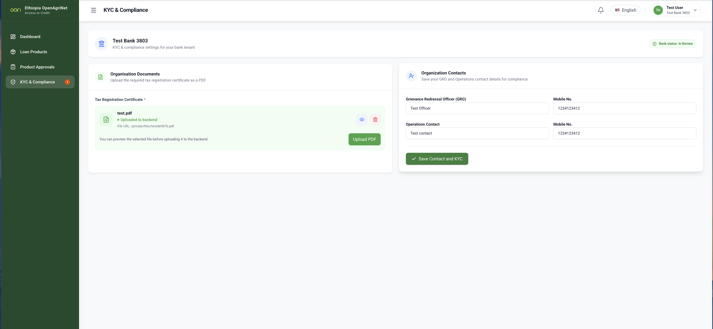

---

## Step 8: Update Bank Status

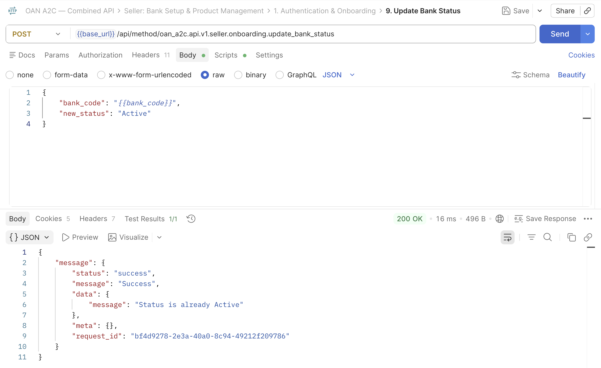

**POST** `/api/method/oan_a2c.api.v1.seller.onboarding.update_bank_status`

Updates the onboarding status of a specified bank. Restricted to Bank Admins.

### Expected Request Body

```json
{
  "bank_code": "{{bank_code}}",
  "new_status": "{{new_status}}"
}
```

#### Variables


| Variable         | Source                                             | Example  |
| ------------------ | ---------------------------------------------------- | ---------- |
| `{{bank_code}}`  | The TIN / bank code                                | `BNK001` |
| `{{new_status}}` | Exactly one of:`Onboarding`, `Active`, `Suspended` | `Active` |

### Success Response

```json
{
  "status": "success",
  "message": "Bank status updated to Active",
  "data": {
    "message": "Bank status updated to Active"
  }
}
```

#### User Interface

The admin dashboard where a bank administrator can update their institution's status on the platform.

## Step 9: Invite Team Members (Optional)

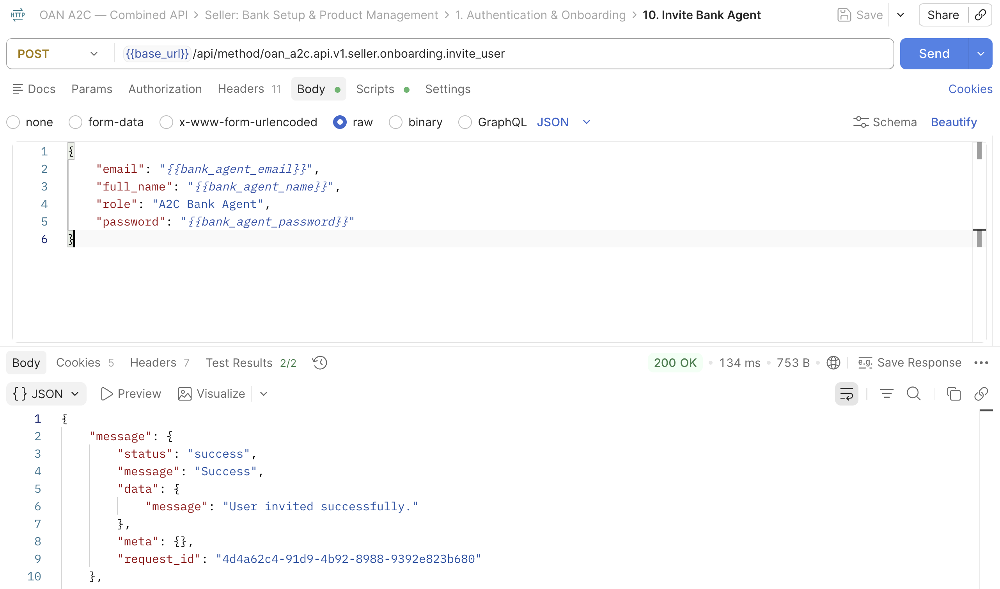

**POST** `/api/method/oan_a2c.api.v1.seller.onboarding.invite_user`

Invite additional team members (e.g., Bank Agents or Admins) to join the organization.

### Expected Request Body

```json
{
  "email": "{{email}}",
  "full_name": "{{full_name}}",
  "role": "{{role}}",
  "password": "{{password}}"
}
```

#### Variables


| Variable        | Source                               | Example          |
| ----------------- | -------------------------------------- | ------------------ |
| `{{email}}`     | New user email                       | `agent@bank.com` |
| `{{full_name}}` | New user full name                   | `Tigist Bekele`  |
| `{{role}}`      | `A2C Bank Admin` or `A2C Bank Agent` | `A2C Bank Agent` |
| `{{password}}`  | Initial password                     | `agentpass123`   |

### Success Response

```json
{
  "status": "success",
  "message": "User invited successfully.",
  "data": {
    "message": "User invited successfully."
  }
}
```

#### User Interface

The user management interface allowing administrators to invite colleagues and assign them specific roles.

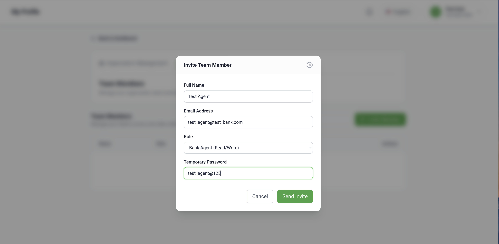

---

## Step 10: Create Loan Product

**POST** `/api/method/oan_a2c.api.v1.seller.loan_products.create_product`

Creates a new loan product under the bank in `Draft` status.

### Expected Request Body

```json
{
  "product_name": "{{product_name}}",
  "min_interest_rate": {{min_interest_rate}},
  "max_amount": {{max_amount}},
  "tenure_months": {{tenure_months}}
}
```

#### Variables


| Variable                | Source                         | Example                         |
| ------------------------- | -------------------------------- | --------------------------------- |
| `{{product_name}}`      | Name of the loan product       | `Smallholder Agricultural Loan` |
| `{{min_interest_rate}}` | Minimum annual interest rate   | `10.5`                          |
| `{{max_amount}}`        | Maximum loan amount allowed    | `50000.0`                       |
| `{{tenure_months}}`     | Duration of the loan in months | `12`                            |

### Success ResponseUser Interface

The product creation form where the bank administrator defines the financial terms of a new loan offering.

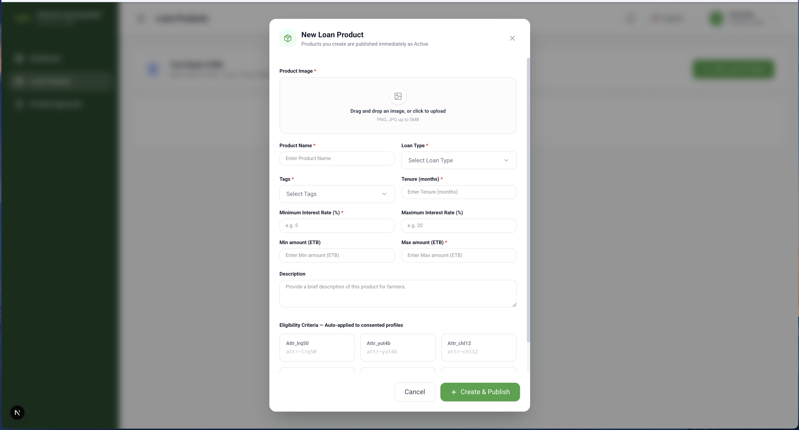

## Step 11: Approve Loan Product (Set Status)

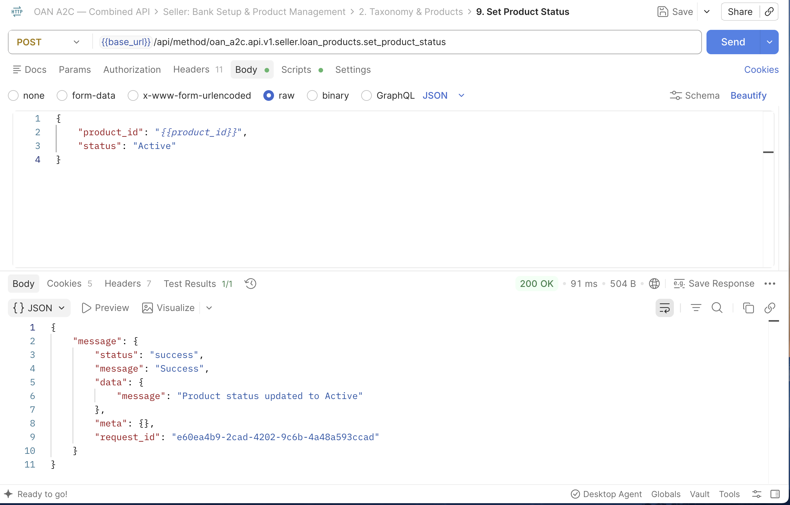

**POST** `/api/method/oan_a2c.api.v1.seller.loan_products.set_product_status`

Transitions the lifecycle status of a loan product (e.g., approving a `Draft` product by setting it to `Active`).

### Expected Request Body

```json
{
  "product_id": "{{product_id}}",
  "status": "{{status}}"
}
```

#### Variables


| Variable         | Source                                   | Example          |
| ------------------ | ------------------------------------------ | ------------------ |
| `{{product_id}}` | The document name/ID of the loan product | `PROD-2026-0001` |
| `{{status}}`     | The target status (e.g.,`Active`)        | `Active`         |

### Success Response

```json
{
  "status": "success",
  "message": "Product status updated to Active",
  "data": {
    "message": "Product status updated to Active"
  }
}
```

#### User Interface

The product management dashboard where an administrator can review a draft loan product and approve it, making it `Active` on the marketplace.

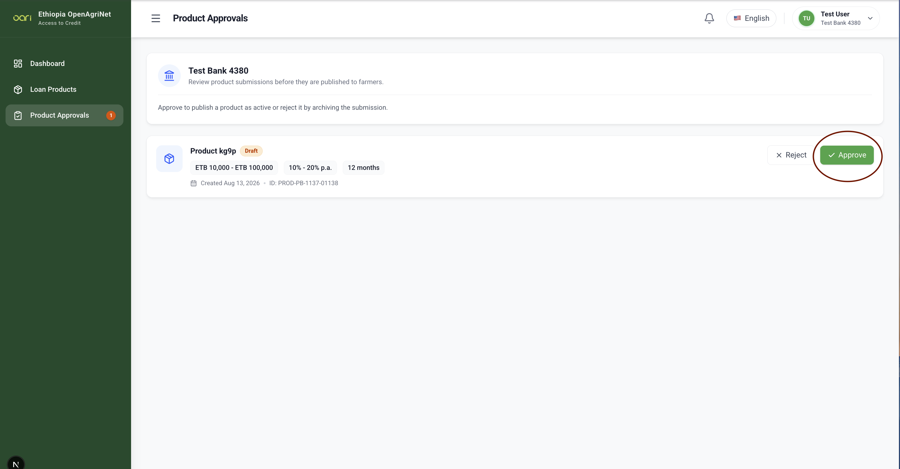

---

## Step 12: Approve Loan Application

**POST** `/api/method/oan_a2c.api.v1.seller.applications.approve`

Approves a specific loan application submitted by a borrower.

### Expected Request Body

```json
{
  "application_id": "{{application_id}}",
  "status": "{{status}}",
  "remarks": "{{remarks}}"
}
```

#### Variables


| Variable             | Source                                       | Example              |
| ---------------------- | ---------------------------------------------- | ---------------------- |
| `{{application_id}}` | The document name/ID of the loan application | `APP-2026-0001`      |
| `{{status}}`         | The target status (e.g.,`Approved`)          | `Approved`           |
| `{{remarks}}`        | Optional notes on the approval               | `All checks passed.` |

### Success Response

```json
{
  "status": "success",
  "message": "Loan application approved successfully.",
  "data": {
    "message": "Loan application approved successfully.",
    "application_id": "APP-2026-0001"
  }
}
```

#### User Interface

The loan processing dashboard where a bank officer reviews and approves a farmer's loan application.

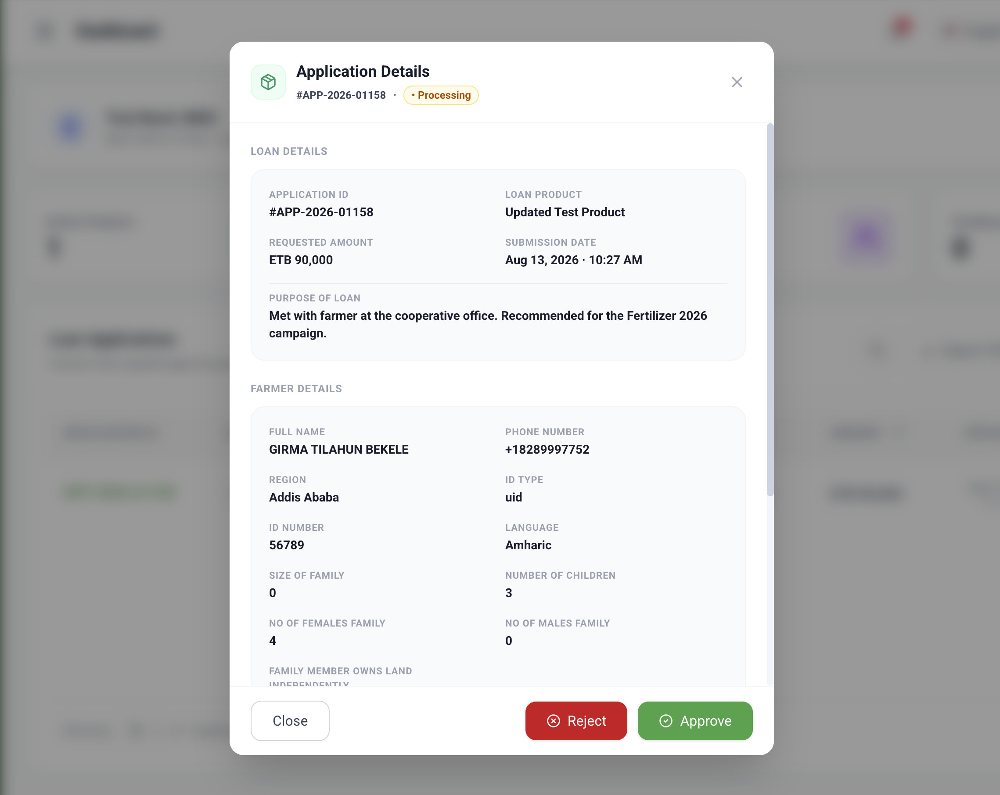
