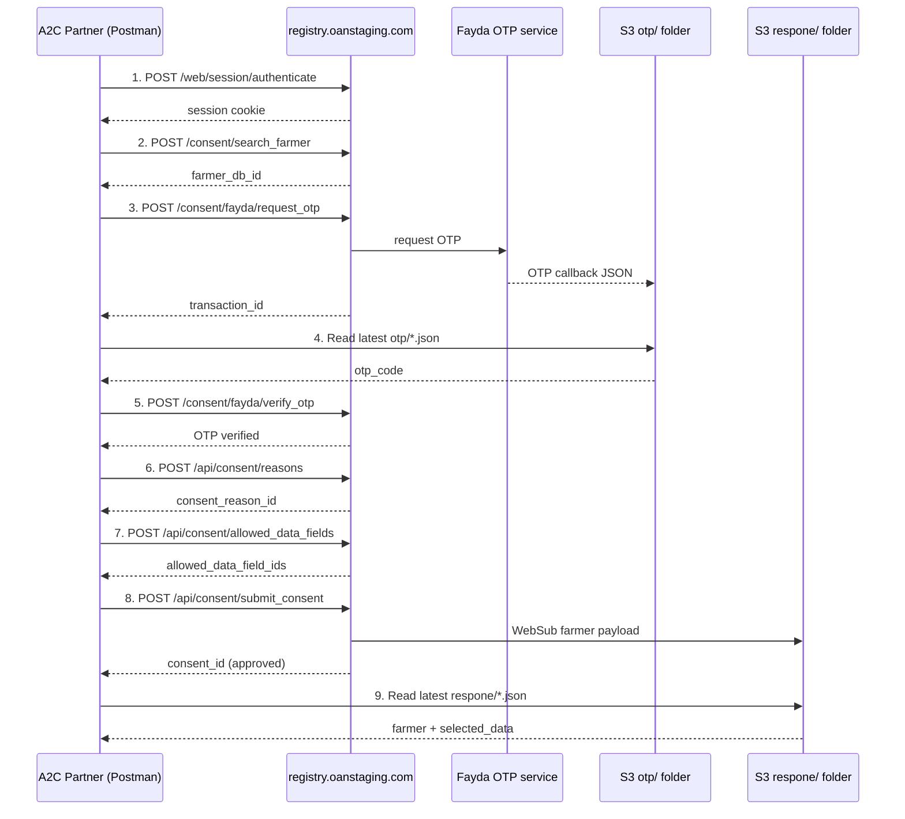

# Consent Management API — Registry A2C

Documentation for the **Consent Management** Postman collection used in the A2C (Access to Credit) loan flow against the OpenG2P/Odoo registry.

| Item | Value |
|------|-------|
| Registry base URL | [https://registry.oanstaging.com](https://registry.oanstaging.com) |
| Odoo database | `odoo` |
| Postman collection | `Consent Management.postman_collection.json` |
| OTP webhook folder | [http://a2c-webhook.s3-website.ap-south-1.amazonaws.com/otp/](http://a2c-webhook.s3-website.ap-south-1.amazonaws.com/otp/) |
| Farmer data webhook folder | [http://a2c-webhook.s3-website.ap-south-1.amazonaws.com/respone/](http://a2c-webhook.s3-website.ap-south-1.amazonaws.com/respone/) |

> **Note:** HTTP requests to `http://registry.oanstaging.com` are redirected (301). Use **HTTPS** for all API calls.

---

## Purpose

These APIs let an A2C partner:

1. Authenticate to the registry
2. Search for a farmer by registration ID
3. Request and verify a Fayda OTP
4. Upload a consent attachment (PDF)
5. Create and approve a consent request
6. Receive the farmer’s shared data via a WebSub webhook payload stored in the public S3 bucket

---

## End-to-end flow



### Recommended request order (Postman)

| Step | Request | Notes |
|------|---------|-------|
| 1 | `1. login` | Saves session cookie & partner_id automatically |
| 2 | `2. search farmer` | Sets `farmer_db_id` from search results |
| 3 | `3. request otp` | Sets `transaction_id` collection variable |
| 4 | `A. list OTP webhooks (S3)` | Lists files under `otp/` |
| 5 | `B. fetch latest OTP webhook` | Sets `otp_code` from webhook JSON |
| 6 | `4. verify otp` | Uses `transaction_id` + `otp_code` |
| 7 | `5. Fetch Consent Reasons` | Sets `consent_reason_id` |
| 8 | `6. Fetch Allowed Data Fields` | Sets `allowed_data_field_ids` |
| 9 | `7. Submit Consent` | Creates and auto-approves consent |
| 10 | `C. list farmer webhooks (S3)` | Finds newest file under `respone/` |
| 11 | `D. fetch latest farmer webhook` | Returns farmer details payload |

---

## Authentication

All registry endpoints except login require an authenticated Odoo session cookie.

### Login

**POST** `/web/session/authenticate`

```json
{
  "jsonrpc": "2.0",
  "method": "call",
  "params": {
    "db": "odoo",
    "login": "a2capp@test.com",
    "password": "a2capp@test.com"
  }
}
```

**Success response (abbreviated):**

```json
{
  "jsonrpc": "2.0",
  "id": null,
  "result": {
    "uid": 6,
    "username": "a2capp@test.com",
    "name": "a2capp@test.com",
    "db": "odoo"
  }
}
```

Postman stores the session cookie when **Send cookies** is enabled (default). Run login before any other registry request.

---

## Registry API endpoints

All registry calls use:

- **Method:** `POST`
- **Header:** `Content-Type: application/json`
- **Body format:** JSON-RPC 2.0 with Odoo `type="json"` routes (`method: "call"`, parameters in `params`)

Successful business responses are wrapped as:

```json
{
  "jsonrpc": "2.0",
  "id": null,
  "result": {
    "success": true,
    "message": "OK",
    "data": { }
  }
}
```

Errors:

```json
{
  "result": {
    "success": false,
    "code": 400,
    "message": "Human-readable error"
  }
}
```

### Search farmer

**POST** `/consent/search_farmer`

Look up a farmer by registration ID, national ID, or other configured identifier before starting the consent flow.

| Parameter | Required | Description |
|-----------|----------|-------------|
| `query` | Yes | Search string (e.g. Fayda UID `1234567`) |

**Example:**

```json
{
  "jsonrpc": "2.0",
  "method": "call",
  "params": {
    "query": "1234567"
  }
}
```

**Success `data`:**

```json
{
  "farmers": [
    {
      "id": 30,
      "name": "ABEBE BEKELE TESFAYE BEKELE TEFAYA",
      "farmer_id": "",
      "phone": "",
      "reg_ids": ["1234567"],
      "profile_image_url": "",
      "otp_identifier": "1234567",
      "otp_identifier_type": "FIN",
      "otp_identifier_source": "UID",
      "otp_available": true
    }
  ]
}
```

Use the returned `id` as `farmer_db_id` in subsequent requests.

### Request OTP

**POST** `/consent/fayda/request_otp`

```json
{
  "jsonrpc": "2.0",
  "method": "call",
  "params": {
    "farmer_id": 30
  }
}
```

**Success `data`:**

```json
{
  "transaction_id": "4886E1A5AD5042FDB49DFFC2EE502E5F",
  "masked_mobile": "09xxxxxx55",
  "masked_email": "",
  "identifier_type": "FIN",
  "identifier_source": "UID"
}
```

The OTP itself is **not** returned in this response. It is written to the `otp/` folder in the webhook bucket configured for the Fayda/staging integration.

### Verify OTP

**POST** `/consent/fayda/verify_otp`

```json
{
  "jsonrpc": "2.0",
  "method": "call",
  "params": {
    "farmer_id": 30,
    "transaction_id": "4886E1A5AD5042FDB49DFFC2EE502E5F",
    "otp_code": "965332"
  }
}
```

OTP codes expire quickly. Always use the value from the latest `otp/` webhook file that matches the `transaction_id` returned by request OTP.

### Fetch Consent Reasons

**POST** `/api/consent/reasons`

Retrieve active reasons configured in the registry.

**Example:**
```json
{
  "jsonrpc": "2.0",
  "method": "call",
  "params": {}
}
```

**Success `data`:**
```json
[
  {
    "id": 1,
    "name": "crop loan",
    "description": "desc for crop loan"
  }
]
```

### Fetch Allowed Data Fields

**POST** `/api/consent/allowed_data_fields`

Retrieve allowed data fields for a consent partner.

**Example:**
```json
{
  "jsonrpc": "2.0",
  "method": "call",
  "params": {
    "partner_id": 16
  }
}
```

**Success `data`:**
```json
[
  {
    "id": 1,
    "name": "farmer_basic",
    "code": "farmer_basic"
  }
]
```

### Submit Consent

**POST** `/api/consent/submit_consent`

Submit consent request with dynamic OTP validation and attachment upload, triggering immediate auto-approval.

| Parameter | Required | Description |
|-----------|----------|-------------|
| `farmer_id` | Yes | Registry `res.partner` ID of the approved farmer |
| `consent_type` | No | Default `specific` |
| `consent_reason_id` | Yes | ID of the consent reason |
| `validity_months` | No | Default `12` |
| `allowed_data_field_ids` | Yes | Array of data-field IDs (e.g. `[1]`) |
| `attachment_base64` | Yes | Base64 encoded consent form PDF |
| `attachment_filename` | Yes | Consent filename |
| `fayda_otp_transaction_id` | Yes | Validated OTP transaction ID |

**Example:**
```json
{
  "jsonrpc": "2.0",
  "method": "call",
  "params": {
    "farmer_id": 30,
    "consent_type": "specific",
    "consent_reason_id": 1,
    "validity_months": 12,
    "allowed_data_field_ids": [1],
    "attachment_base64": "<base64-encoded-pdf>",
    "attachment_filename": "consent_form_test.pdf",
    "fayda_otp_transaction_id": "4886E1A5AD5042FDB49DFFC2EE502E5F"
  }
}
```

**Success `data`:**
```json
{
  "consent_id": 96,
  "status": "approved",
  "auto_approved": true,
  "auto_approval_failed": false,
  "auto_approve_method": "otp",
  "error_details": null
}
```

---

## Webhook bucket

The staging environment uses a public S3 website bucket as a webhook sink for testing.

| Location | URL | Purpose |
|----------|-----|---------|
| OTP folder | [http://a2c-webhook.s3-website.ap-south-1.amazonaws.com/otp/](http://a2c-webhook.s3-website.ap-south-1.amazonaws.com/otp/) | Fayda OTP callback JSON files |
| Response folder | [http://a2c-webhook.s3-website.ap-south-1.amazonaws.com/respone/](http://a2c-webhook.s3-website.ap-south-1.amazonaws.com/respone/) | Farmer data after consent approval |

### Retrieving OTP

**Option A — Browser**

Open the [OTP folder](http://a2c-webhook.s3-website.ap-south-1.amazonaws.com/otp/), open the newest JSON file, and copy the OTP value into the Postman `otp_code` variable.

**Option B — S3 list API (used by Postman helpers)**

```bash
curl -s "https://a2c-webhook.s3.ap-south-1.amazonaws.com/?list-type=2&prefix=otp/&max-keys=20"
```

Fetch the newest OTP payload:

```bash
curl -s "http://a2c-webhook.s3-website.ap-south-1.amazonaws.com/otp/2026-06-01T17-47-13_5ac7f1fa.json"
```

**Sample OTP webhook:**

```json
{
  "transactionID": "C67AC60C2FF541BBB0150F0E425C4783",
  "otp": "965332",
  "individualId": "12345",
  "individualIdType": "FIN",
  "timestamp": "2026-06-01T17:47:13.643488"
}
```

Common fields the collection test script checks:

- `otp` / `otp_code`
- `transaction_id` / `transactionID`

### Retrieving farmer data after approval

List files under `respone/`:

```bash
curl -s "https://a2c-webhook.s3.ap-south-1.amazonaws.com/?list-type=2&prefix=respone/&max-keys=20"
```

Fetch the newest payload (ignore `webhook-respone.json` and `index.html`):

```bash
curl -s "http://a2c-webhook.s3-website.ap-south-1.amazonaws.com/respone/2026-06-06T10-40-35_a4014132.json"
```

---

## Sample farmer webhook payload

After approval, a file similar to this appears under `respone/`:

```json
{
  "source": "g2p_ati_consent_mgt",
  "event_type": "WEBSUB_INDIVIDUAL_UPDATED",
  "published_at": "2026-06-06 10:40:35",
  "consent": {
    "id": 95,
    "consent_creation_request_id": "57782a91-bbd7-4764-98c7-b1b136401aec",
    "consent_type": "specific",
    "status": "approved",
    "approved_at": "2026-06-06 10:40:35",
    "validity_from": "2026-05-06 00:00:00",
    "validity_to": "2027-05-06 00:00:00",
    "requested_field_codes": ["farmer_basic"],
    "published_field_codes": ["farmer_basic"],
    "data_field_mode": "dynamic"
  },
  "consent_partner": {
    "id": 16,
    "name": "a2capp@test.com",
    "ref": false,
    "websub_config_id": 2,
    "websub_config_name": "Local Test WebSub (Mock)1"
  },
  "farmer": {
    "id": 30,
    "farmer_id": false,
    "name": "ABEBE BEKELE TESFAYE BEKELE TEFAYA"
  },
  "selected_data": {
    "farmer": {
      "First Name(English)": false,
      "Father Name": false,
      "Email": false,
      "Region": {
        "id": 1,
        "name": "Addis Ababa",
        "code": "ET14"
      },
      "Zone": {
        "id": 1,
        "name": "Gulele Subcity",
        "code": "ET1401"
      },
      "Woreda": {
        "id": 1,
        "name": "Wereda 01",
        "code": "140101"
      }
    }
  }
}
```

| Field | Meaning |
|-------|---------|
| `consent` | Approved consent metadata |
| `consent_partner` | Partner that requested data |
| `farmer` | Farmer registry record |
| `selected_data` | Published field values per WebSub configuration |

---

## Collection variables

| Variable | Default | Description |
|----------|---------|-------------|
| `base_url` | `https://registry.oanstaging.com` | Registry base URL (HTTPS) |
| `db` | `odoo` | Odoo database |
| `login` / `password` | `a2capp@test.com` | Test partner credentials |
| `partner_id` | `16` | Consent parent partner for `a2capp@test.com` |
| `farmer_db_id` | `30` | Test farmer (set automatically by search) |
| `farmer_query` | `1234567` | Search query for `2. search farmer` |
| `allowed_data_field_ids` | `[1]` | Must match partner-allowed fields |
| `transaction_id` | *(auto)* | From request OTP |
| `otp_code` | *(auto)* | From OTP webhook |
| `consent_id` | *(auto)* | From create consent |
| `attachment_id` | *(auto)* | From upload attachment |
| `webhook_url` | S3 website root | OTP bucket browser/API |
| `webhook_response_url` | S3 `respone/` path | Farmer payload folder |

---

## Terminal test script

A shell script is available at `test_consent_management_apis.sh`:

```bash
chmod +x test_consent_management_apis.sh
./test_consent_management_apis.sh
```

The script runs the full Postman flow: login → search farmer → request OTP → verify OTP → upload attachment → create consent → approve → fetch farmer webhook.

Override defaults with environment variables:

```bash
BASE_URL=https://registry.oanstaging.com \
DB=odoo \
LOGIN=a2capp@test.com \
PASSWORD=a2capp@test.com \
PARTNER_ID=16 \
FARMER_QUERY=1234567 \
./test_consent_management_apis.sh
```

If OTP auto-detection from S3 fails (webhook delivery delay), pass the code manually:

```bash
OTP_CODE=965332 TX_ID=C67AC60C2FF541BBB0150F0E425C4783 ./test_consent_management_apis.sh
```

**Verified on staging (2026-06-06):** login, search farmer, request OTP, upload attachment, create consent, and approve all returned HTTP 200. Farmer webhook `respone/2026-06-06T10-40-35_a4014132.json` was published after approval. OTP webhook delivery to `otp/` was stale during testing; verify OTP may fail with expired codes but the remaining flow still succeeds on staging.

---

## Troubleshooting

| Symptom | Likely cause |
|---------|--------------|
| `301 Moved Permanently` or `Invalid JSON data` | Using HTTP instead of HTTPS |
| `Database not found` | Wrong `db` value — staging uses `odoo`, not `management` |
| `Access denied` on OTP endpoints | User is not linked to a consent parent partner |
| `No valid allowed_data_field_ids` | Field IDs not configured on the partner |
| `WebSub configuration is not selected` on approve | Partner missing active External WebSub config |
| OTP verify fails (`OTP session expired`) | Expired OTP, stale webhook file, or `transaction_id` mismatch |
| No new file in `otp/` | Fayda callback not reaching the bucket; use manual `OTP_CODE` |
| No file in `respone/` | Approval failed, WebSub not configured, or job still queued |
| Empty `selected_data` in webhook | WebSub config has no publishable fields for this farmer |

---

## Related resources

- Registry login UI: [https://registry.oanstaging.com](https://registry.oanstaging.com)
- OTP webhook browser: [http://a2c-webhook.s3-website.ap-south-1.amazonaws.com/otp/](http://a2c-webhook.s3-website.ap-south-1.amazonaws.com/otp/)
- Farmer webhook browser: [http://a2c-webhook.s3-website.ap-south-1.amazonaws.com/respone/](http://a2c-webhook.s3-website.ap-south-1.amazonaws.com/respone/)
