# Consent Portal Workflow & Webhook Testing Guide

Follow these steps to submit consent requests on the Agricultural Transformation Institute (ATI) Consent Portal and verify the associated OTP and webhook responses.

---

### Step 1: Login
Access the Consent Portal login page at `https://registry.oanstaging.com/web/login`. Log in using the email `a2c@test.com` and the password `a2c@test.com`.

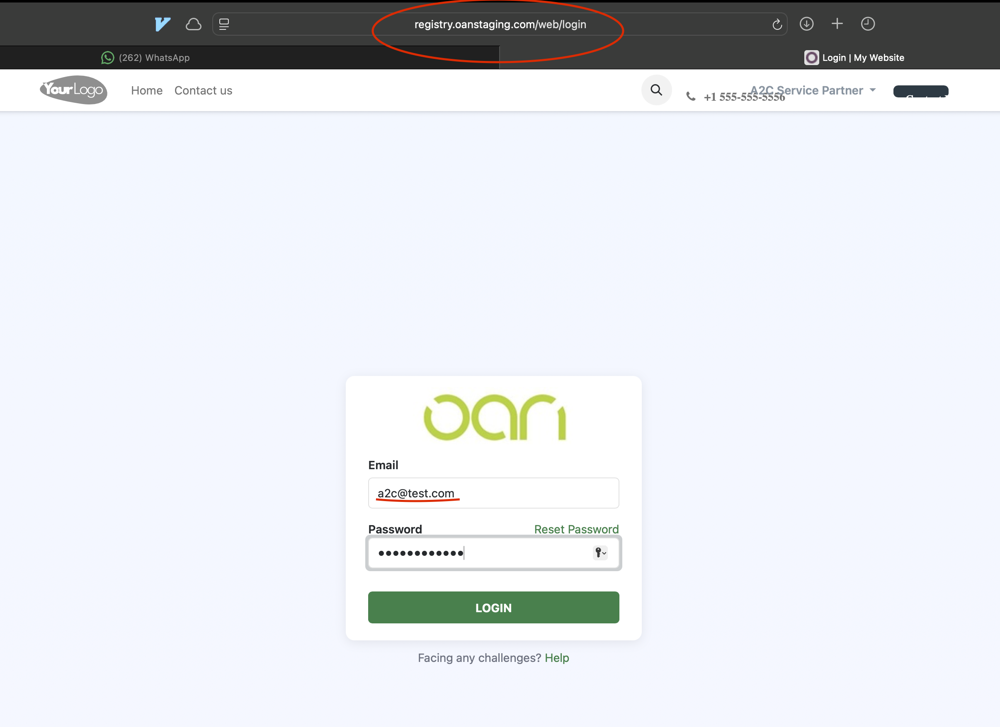

---

### Step 2: Navigate to Consent Portal
Once logged in, this displays the main dashboard with an empty search field under the **Farmer** section.

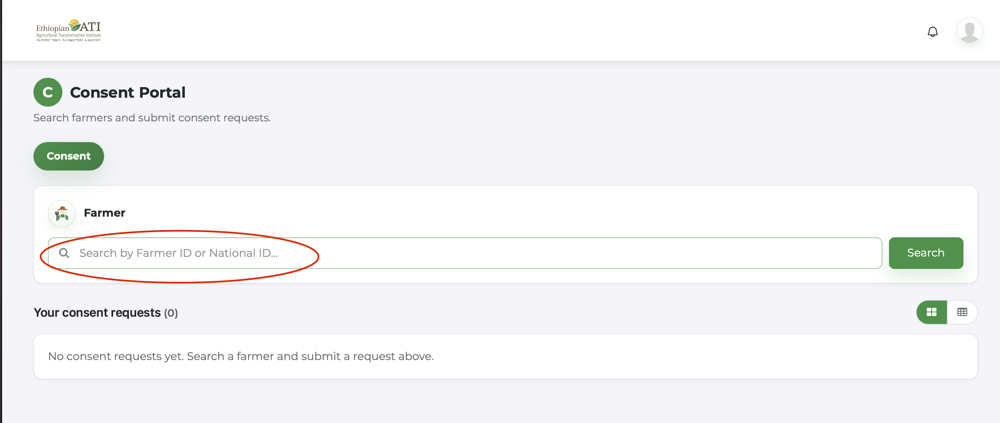

---

### Step 3: Search for a Farmer
In the **Search by Farmer ID or National ID...** input field, enter the ID of the farmer you wish to find (e.g., `123456` or `1234567`) and click **Search**.

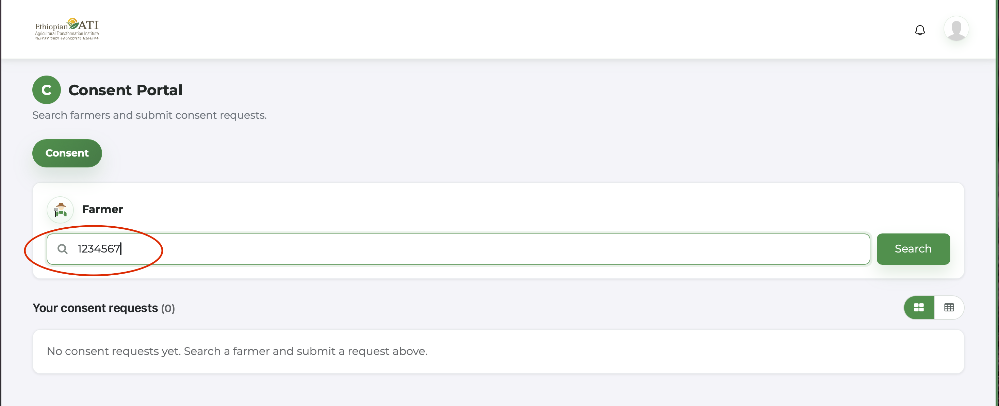

---

### Step 4: Handling "Not Found" State
If the entered ID does not exist or matches no record in the registry, a red **Not Found** badge appears inside the search input box.

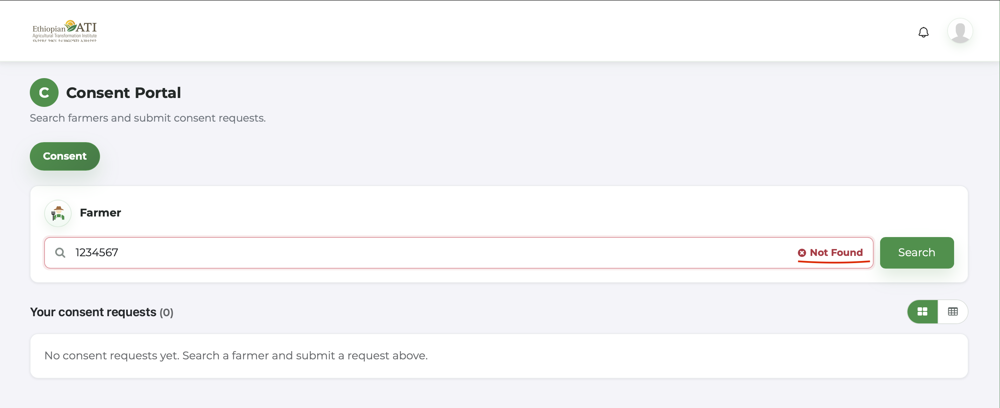

---

### Step 5: Successful Search Results
If a valid farmer ID (e.g., `123456`) is found, a green **Found** checkmark badge appears in the input field, and the button changes to **Select**.

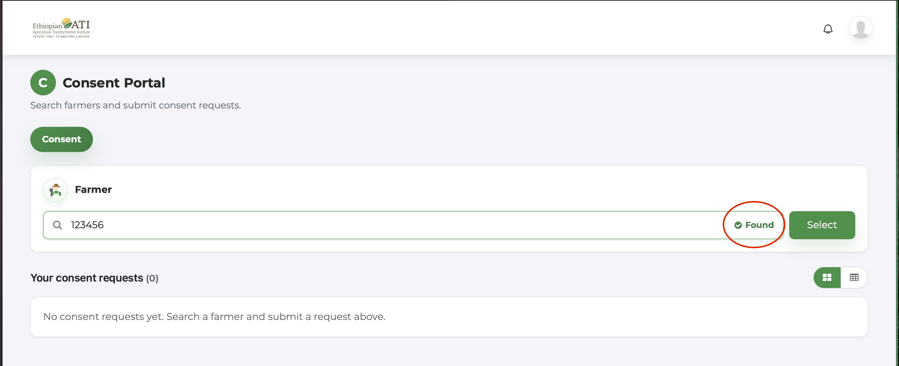

---

### Step 6: Select Verification Method
Click the **Select** button to reveal the **Verification** section. Select one of the two available authentication methods: **Fayda OTP** or **Face + Liveness**.

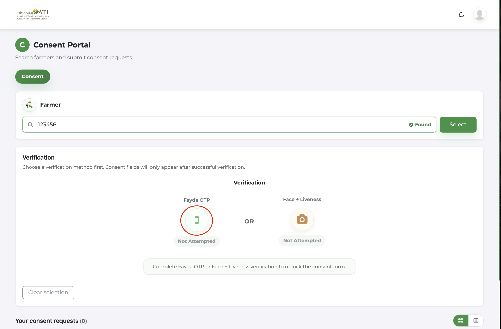

---

### Step 7: Triggering Fayda OTP Verification
Click **Fayda OTP** to open the verification modal, then click **Send Code** to request a 6-digit OTP code to be sent to the farmer's registered number.

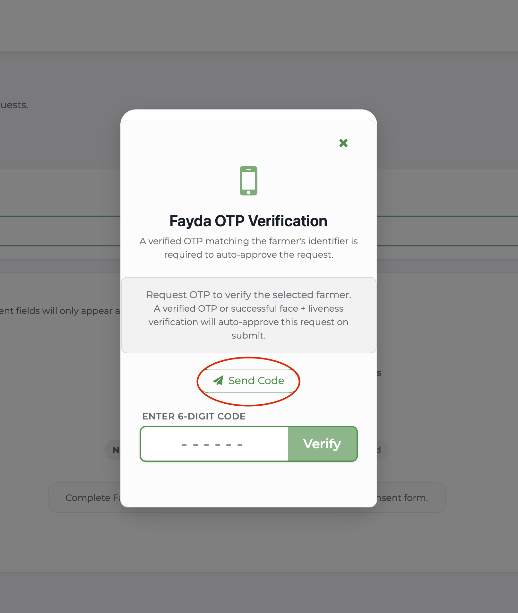

---

### Step 8: OTP Dispatched
Once the OTP request is sent, the modal transitions to display the confirmation message along with the farmer's masked mobile number (e.g., `09xxxxxx55`) to which the code was dispatched. The modal is now waiting for the input of the 6-digit code.

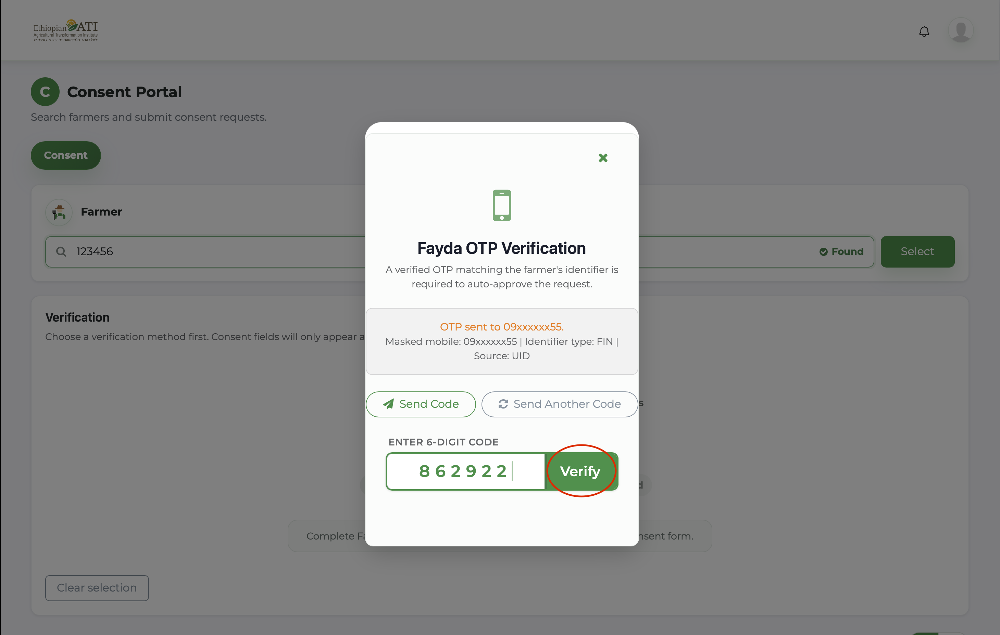

---

### Step 9: Access the Webhook Browser to Retrieve OTP
To retrieve the generated OTP for testing, navigate to the S3 bucket browser at:
`http://a2c-webhook.s3-website.ap-south-1.amazonaws.com`

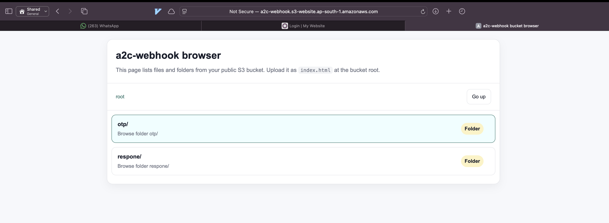

---

### Step 10: Open the OTP Folder
Click on the **otp/** folder in the bucket list.

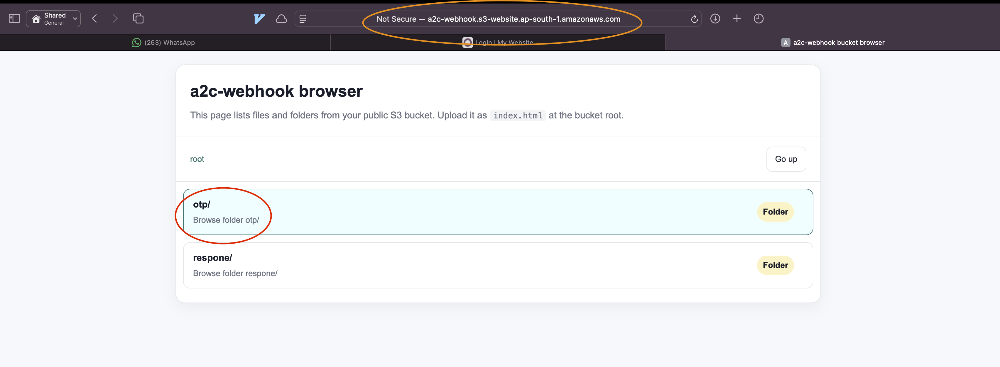

---

### Step 11: Locate the Latest OTP File
Find the latest `.json` file matching the timestamp of your request.

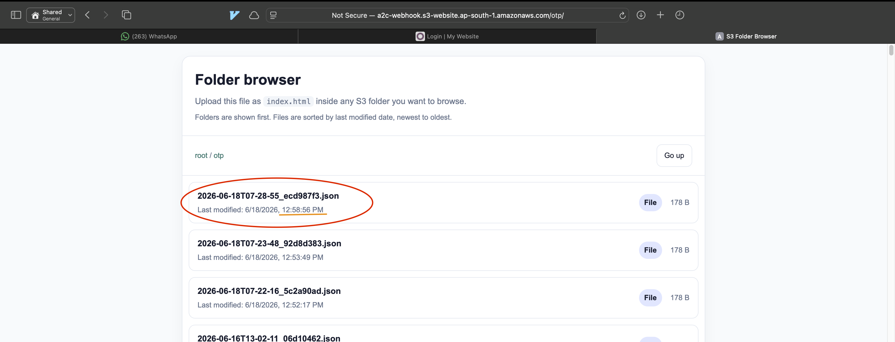

---

### Step 12: Copy the OTP Code
Open the `.json` file to view the payload. Note and copy the `otp` value (e.g., `187201`).

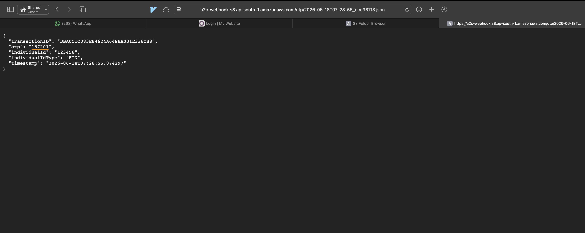

---

### Step 13: Enter the OTP Code
Return to the Consent Portal, and enter the 6-digit OTP code copied from the webhook JSON response into the **ENTER 6-DIGIT CODE** input field.if done very late , the OTP might become expire and you will need to send the OTP again

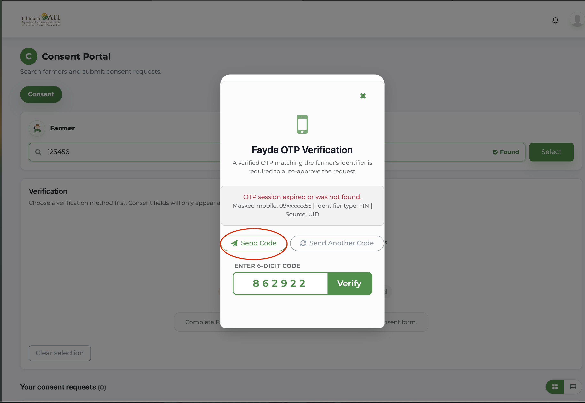

---

### Step 14: Complete OTP Verification
Return to the Consent Portal, enter the 6-digit code, and click **Verify**. Upon successful verification, a **Success!** dialog appears. Click **Close** to return to the request form.

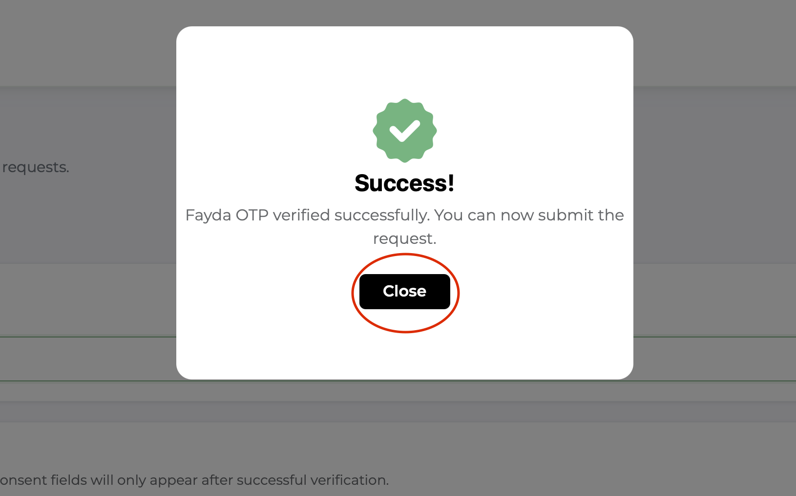

---

### Step 15: Select Consent Type
Once verified, the **Consent Details** section is unlocked. Choose a option from each drop down 

We need to provide following information :
1. Consent Type ( either `Specific` or `Baseline` )
2. Select a **Duration** (e.g., `12 months`).
3. Provide a **Consent Reason** (e.g., `Crop Loan Processing`).
4. Select the requested data fields.
5. Upload the signed consent form attachment (PDF format).
6. Click **Submit Request**.

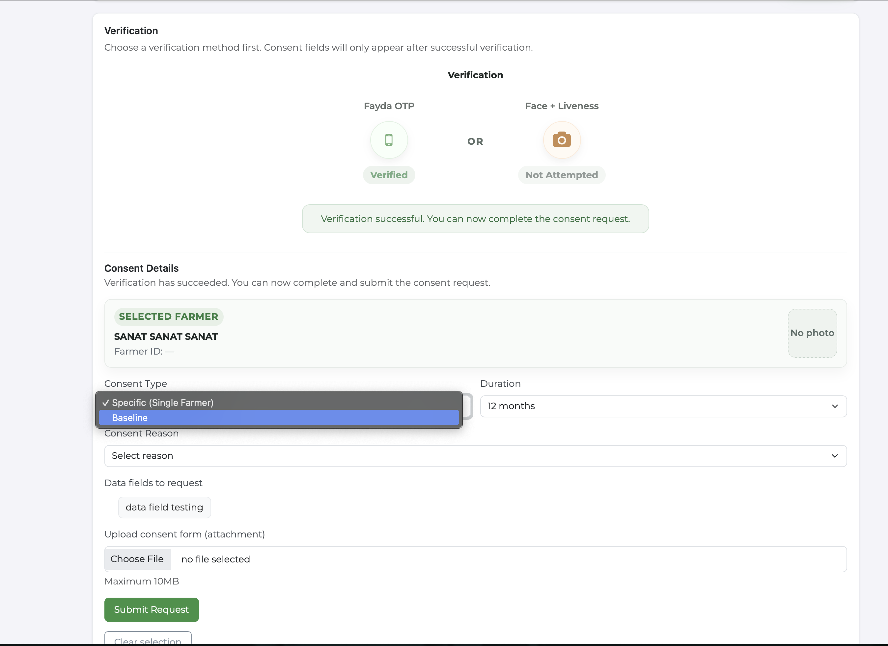

---

### Step 16: Complete and Submit the Request

Once completed press **Submit Request** button

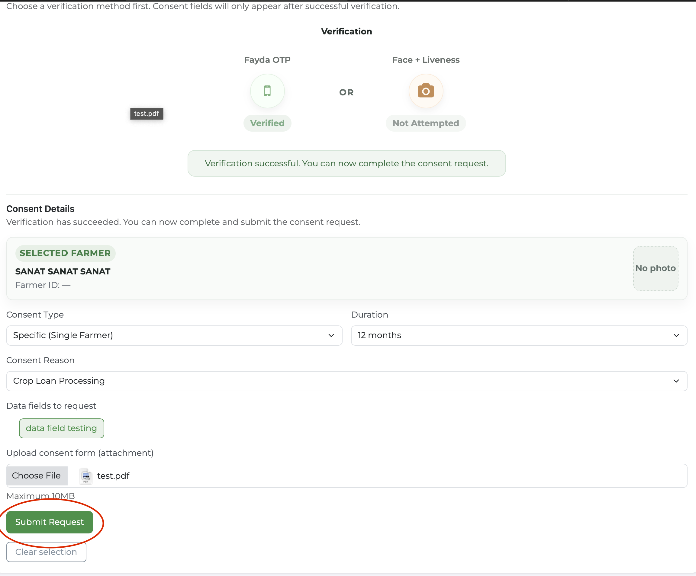

---

### Step 17: Viewing Submitted Requests
Upon submission, a success banner appears stating that the request was submitted and automatically approved. Click **View Details** on the request card under the **Your consent requests** list.

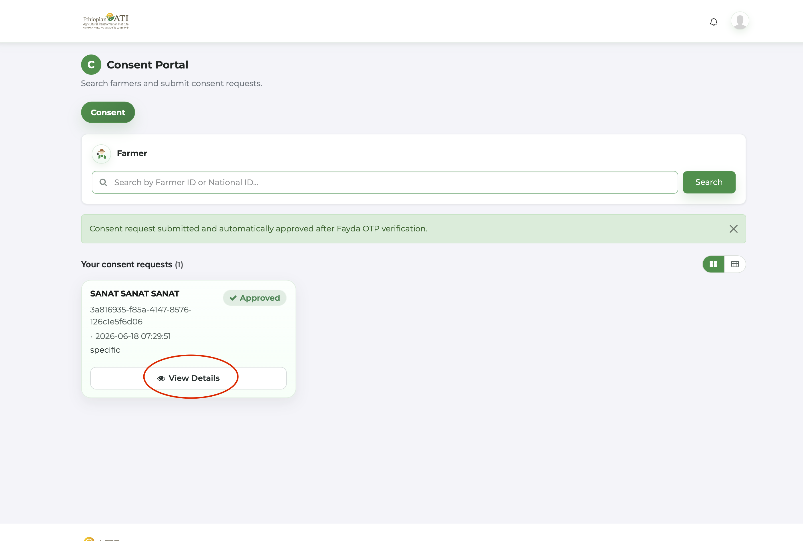

---

### Step 18: Reviewing Request Details
The details modal displays the request status, validity period, Fayda OTP verification timestamp, purpose, and attachments. Click **Back to requests** to close the details view.

---

### Step 19: Navigate to the Webhook Responses
To verify that the webhook notification was dispatched successfully, return to the S3 bucket browser root and open the **respone/** folder.

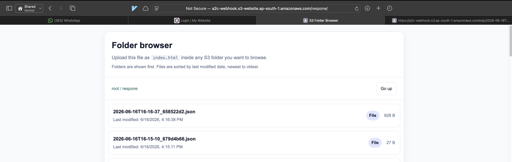

---

### Step 20: View Webhook Notification Payload
Open the latest JSON file to inspect the webhook notification details, confirming that the `WEBSUB_INDIVIDUAL_UPDATED` event was correctly published.

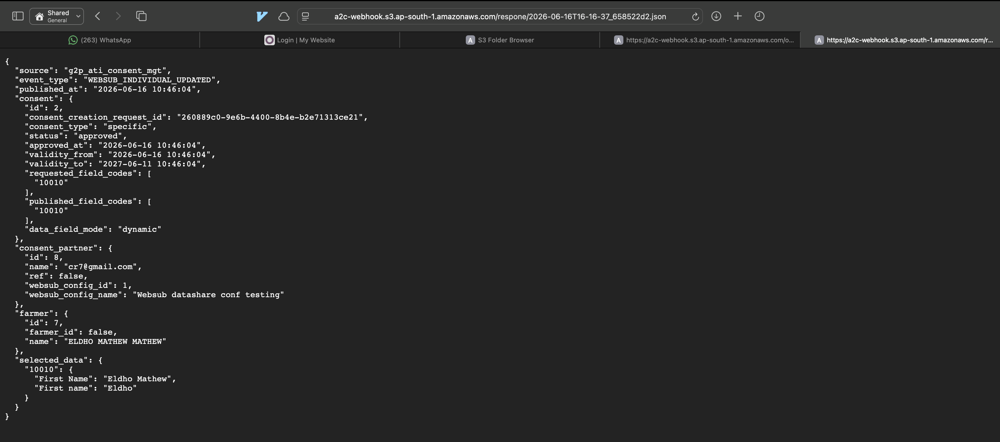